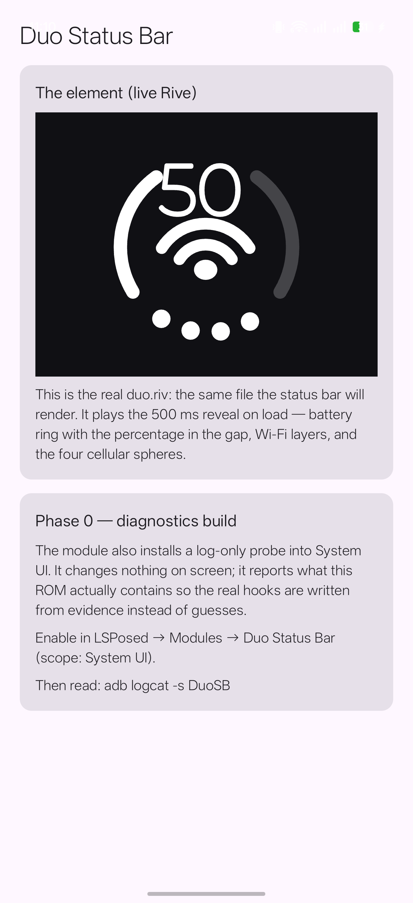

# Duo Status Bar

[](https://github.com/kvmy666/duoStatusBar/releases)
[](https://github.com/kvmy666/duoStatusBar/releases)
[](https://github.com/kvmy666/duoStatusBar/actions/workflows/ci.yml)
[](https://developer.android.com)
[](https://modules.lsposed.org/module/io.github.kvmy666.duostatusbar)

Apple's "Duo" indicator — the battery ring with the percentage in its gap, the Wi-Fi arcs and the cellular
spheres combined into **one** element — as a status bar for custom ROMs, animated with [Rive](https://rive.app).
Written for a rooted device running LSPosed: no system file is touched, nothing is patched, the module only
draws, and it can be switched off instantly.



## What it does

* Replaces the stock **battery**, **Wi-Fi** and **cellular** icons with a single element (FR-08).
* Battery ring with the percentage in the top gap, splitting the indicator into two halves (FR-16).
* Battery colour: green while charging, yellow in power save, red under 20 % (FR-15).
* Wi-Fi as two arcs plus the centre dot, lit per signal level; four cellular spheres (FR-25).
* A charging bolt, and an airplane glyph that the Wi-Fi arcs **morph into** (FR-25).
* A 500 ms reveal on screen-on and unlock (FR-25).
* Every visual parameter is bound to a view model, so the host drives all of it — nothing is baked in.
* A settings app with the "Red Wine" Material 3 theme, a live preview, size and position, and diagnostics.

## Status, honestly

Everything below is what is *in the repository*. The open items are listed with the reason they are open.

| Area | State |
|---|---|
| Device + ROM probing, SystemUI view tree measured | done (`docs/devicereport-oos16.md`) |
| `duo.riv`: geometry, 19 bound properties, reveal + airplane state machine | done; renders in the app and in the Rive CLI |
| Icon hiding and injection | in code; verified on the device for the Canvas element, Rive pending one device run |
| Rive inside SystemUI | first attempt's root cause found and fixed (`RiveInit`); needs a confirmation run |
| Settings app, app ↔ module channel, gestures | in code, needs a device run |
| Multi-ROM | AOSP/ColorOS have measured ids; **Xiaomi is marked unverified in code** until a device is measured |
| Release automation | CI (tests, build, Rive checks) and tag-driven release are written |

The Rive path is the genuinely unproven part on hardware: `RiveAnimationView` is a `TextureView`, so it needs a
hardware-accelerated window. The module only attempts it when the window reports itself accelerated *and* the
crash breaker allows it — `docs/evidence/phase3-attempt1-crash.txt` explains the failure that made both
precautions necessary.

## Requirements

* Android 15 or newer on a custom ROM, with **LSPosed** (tested against OnePlus 15 / OxygenOS 16 / Android 16,
  KernelSU + LSPosed 2.2.0).
* Scope: **System UI** only. The module never hooks `system_server`.

## Install

1. Install the APK from [Releases](https://github.com/kvmy666/duoStatusBar/releases).
2. LSPosed → **Modules → Duo Status Bar** → enable it, and tick **System UI** in the scope.
3. Restart System UI (or reboot).
4. Open the app and switch the element on.

The module is **off until you switch it on**: with the default settings it hooks nothing, hides nothing, and
consumes no touch event.

## Safety, and how to undo it

* The stock icons are hidden, not destroyed: their visibility and sizes are remembered and restored when the
  element is switched off (`hook/DuoIconHost`).
* A **kill switch** that works even if the app cannot be opened:

  ```powershell
  adb shell settings put global duo_statusbar_stage 0   # off
  adb shell settings put global duo_statusbar_stage 1   # Canvas drawing, no native code
  adb shell settings put global duo_statusbar_stage 2   # Rive
  ```

* A **crash breaker**: an attempt is recorded *before* the Rive view is created and cleared once the drawing
  survives. Two un-cleared attempts mean Rive died twice, so Rive is refused (the Canvas element is used
  instead) until the counter is cleared — a bad build cannot crash-loop the status bar.

## Gestures (optional)

Taps on the element are handed to **[Auto Expand](https://github.com/kvmy666/AutoExpandNotifications)**, my
other module, which owns the actions. This module implements no second copy of any action, so the two cannot
disagree about what a tap means — and with "No Action" (the default) the element does not consume a single
touch event. The split is deliberate: **Duo draws, Auto Expand acts.**

## Build

```powershell
$env:JAVA_HOME = 'C:\Program Files\Android\Android Studio\jbr'   # JDK 17+, not the system JDK 8
.\gradlew.bat :app:assembleDebug :app:testDebugUnitTest
```

The Rive scene is authored as text (`rive/duo/scene.rml`) and compiled with the Rive CLI:

```powershell
& "$env:USERPROFILE\.rive\bin\rive.exe" rive\duo --verify
& "$env:USERPROFILE\.rive\bin\rive.exe" rive\duo --once      # -> rive/duo/build/duo.riv
```

`app/src/main/res/raw/duo.riv` must be that built file; CI checks the two are byte-identical, because a
preview and a status bar drawing different files is a bug that looks like magic.

## Bugs and feedback

* **Issues:** https://github.com/kvmy666/duoStatusBar/issues — a log is worth more than a description.
  Send the module log: LSPosed → its own log, or
  `adb shell su -c 'cp /data/adb/lspd/log/modules_*.log /sdcard/Download/'` and pull it (lines prefixed
  `DuoSB |`). `adb logcat -d -s DuoSB` only works on ROMs that do not filter SystemUI's logging.
* **Telegram:** [@kvmy1](https://t.me/kvmy1)

## Support

If this is useful to you: [Buy Me a Coffee](https://www.buymeacoffee.com/kroomfahd) or
[PayPal](https://paypal.me/kroomfahd).

## Credits

* The element's geometry was informed by [`lingyired/status-trio`](https://github.com/lingyired/status-trio) and
  the author's own screenshots. What was reused and what was not is written down in `docs/references.md`.
* Built on [Rive](https://rive.app), [LSPosed](https://github.com/LSPosed/LSPosed) and AndroidX / Compose.
